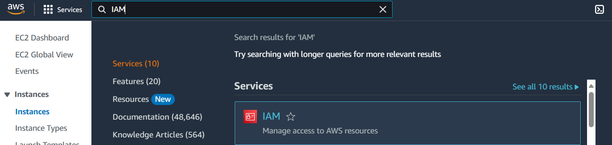
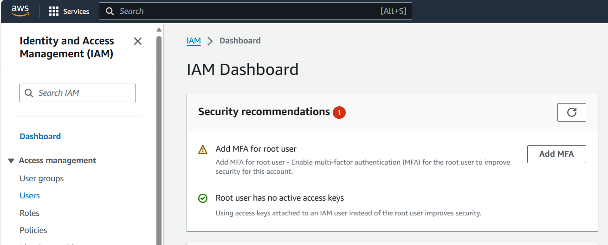
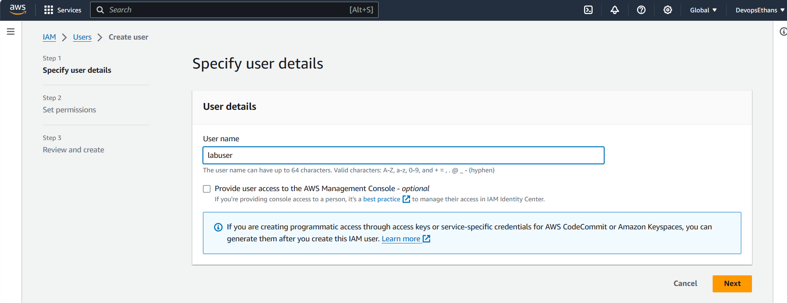
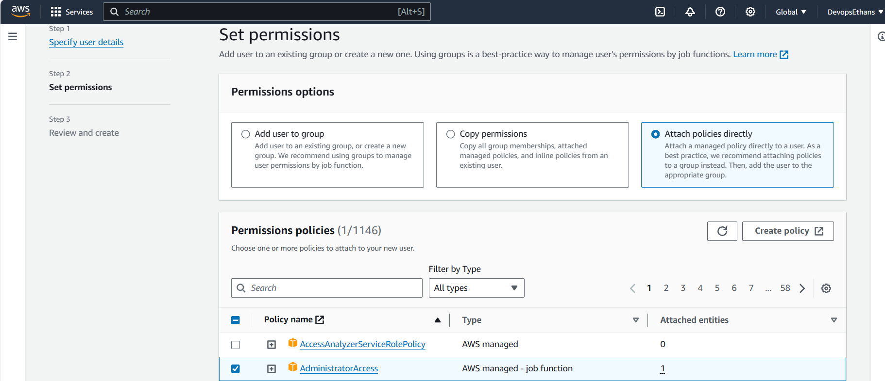
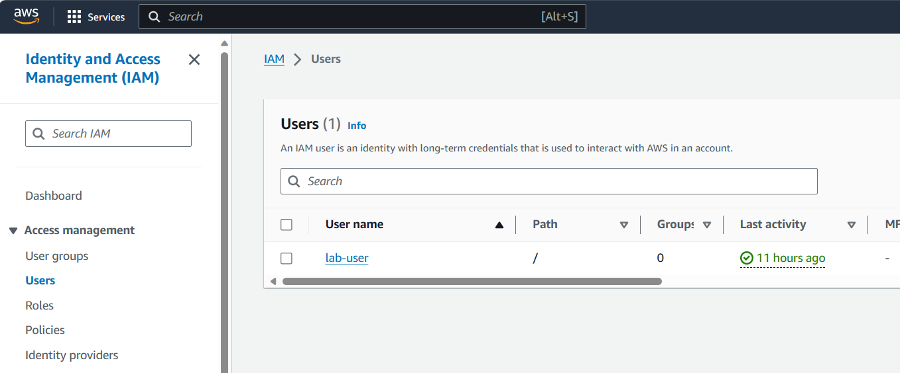
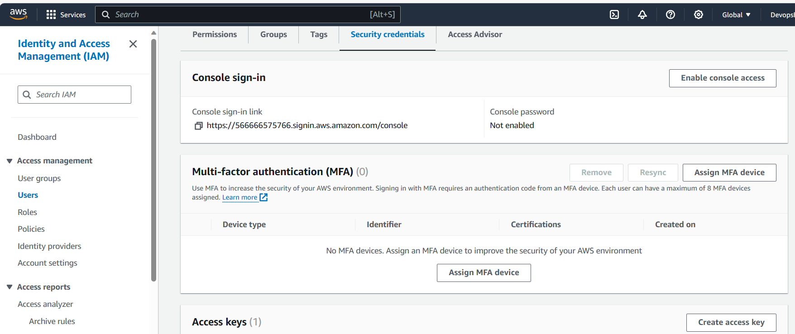
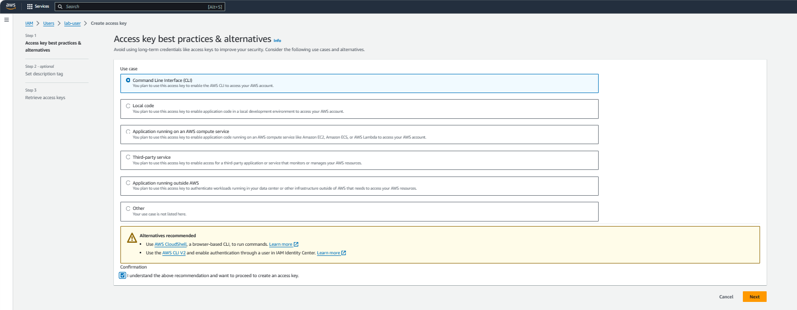
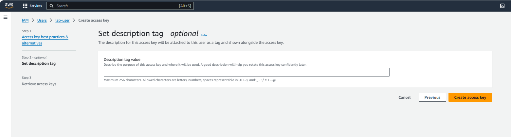
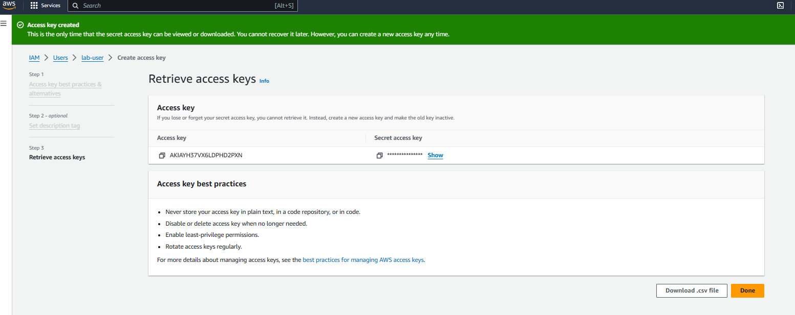

# Provisioning EC2 Instance using Cloudformation

## Pre-requiste
1. Use IDE like VS Code or IntelliJ if you wan to write cloudformation code locally.

2. Install git in your terminal
`Linux : sudo yum install git`
`Ubuntu : sudo apt install git`
`Windows install gitbash : https://git-scm.com/downloads`

3. git clone the lab repositories to the working folder or workspace, where you want to execute the cloudformation code
`git clone <repo>`

4. Create an IAM user in AWS console
i. Go to AWS consle and search for IAM service

ii. Click on Users to create a user

iii. Create a user  by giving some name and Adminstartor access permission to that user(Attach policy directly).

iv. Once user is created user will be visible in user page, click on that user and go to Security Credential as shown in images below. Create access key and download the csv file and save the Access key and Security key details in your system.

5. Install awscli in your terminal ( I have used ubuntu OS as my terminal)
`curl "https://awscli.amazonaws.com/awscli-exe-linux-x86_64.zip" -o "awscliv2.zip"`
`sudo apt install unzip`
`sudo apt install unzip`
`sudo ./aws/install`
`aws --version`
Pass the IAM users access ID and Secret ID when asked. Rest all can be left as it is.
`aws configure` 